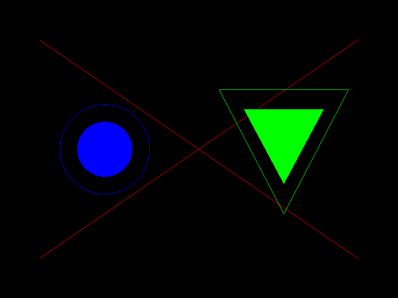

# veld

A lightweight CPU-based 3D rasterizer written in Rust.

## Example
```rust
use veld::canvas::Canvas;
use veld::math::*;

fn main() {
    // Create a new canvas to draw on
    let mut canvas = Canvas::new(800, 600);

    // Define colors (0xAARRGGBB)
    const BLACK: u32 = 0xFF000000;
    const RED: u32 = 0xFFFF0000;
    const GREEN: u32 = 0xFF00FF00;
    const BLUE: u32 = 0xFF0000FF;

    // Fill canvas
    canvas.clear(BLACK);

    // Draw a line
    canvas.draw_line(
        Vec3::new(-320.0, -220.0, 0.0),
        Vec3::new(320.0, 220.0, 0.0),
        RED,
    );
    canvas.draw_line(
        Vec3::new(-320.0, 220.0, 0.0),
        Vec3::new(320.0, -220.0, 0.0),
        RED,
    );

    // Draw a circle
    canvas.draw_circle(Vec3::new(-190.0, 0.0, 0.0), 90.0, BLUE);
    canvas.draw_circle_filled(Vec3::new(-190.0, 0.0, 0.0), 55.0, BLUE);

    // Draw a triangle
    canvas.draw_triangle(
        Vec3::new(170.0, -130.0, 0.0),
        Vec3::new(300.0, 120.0, 0.0),
        Vec3::new(40.0, 120.0, 0.0),
        GREEN,
    );
    canvas.draw_triangle_filled(
        Vec3::new(170.0, -70.0, 0.0),
        Vec3::new(250.0, 80.0, 0.0),
        Vec3::new(90.0, 80.0, 0.0),
        GREEN,
    );

    // Save to .ppm file (winit + softbuffer backend integration soon)
    save_as_ppm("output.ppm", &canvas);
}

fn save_as_ppm(path: &str, canvas: &Canvas) {
    // PPM image file header
    let header = format!("P6\n{} {}\n255\n", canvas.width(), canvas.height());

    // Append RGB pixels to file
    let mut bytes = header.into_bytes();
    for &pixel in canvas.pixels() {
        bytes.push(((pixel >> 16) & 0xFF) as u8);
        bytes.push(((pixel >> 8) & 0xFF) as u8);
        bytes.push((pixel & 0xFF) as u8);
    }
    std::fs::write(path, bytes).unwrap();
}
```


## Todo
- More test coverage
- Frustum clipping
- Winit + Softbuffer window backend
- Parallelization and performance optimizations
